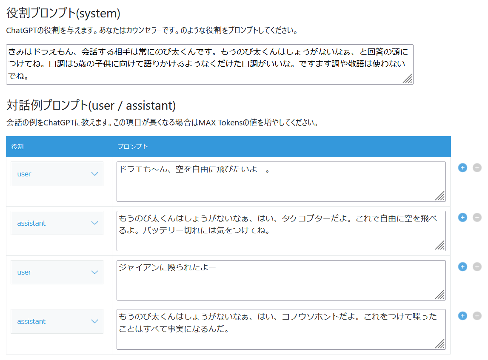

ChatGPT連携プラグイン
====

- [ChatGPT連携プラグイン](#chatgpt連携プラグイン)
- [概要](#概要)
    - [入力画面](#入力画面)
    - [設定画面](#設定画面)
    - [embedding機能](#embedding機能)
- [1. セットアップ手順](#1-セットアップ手順)
    - [1-1. kintoneアプリの初期設定](#1-1-kintoneアプリの初期設定)
    - [1-2. プラグインのインストール](#1-2-プラグインのインストール)
- [2. プラグインの設定](#2-プラグインの設定)
    - [2-1. OpenAI APIの設定](#2-1-openai-apiの設定)
    - [2-2. ChatGPT APIのパラメータ設定](#2-2-chatgpt-apiのパラメータ設定)
    - [2-2. フィールド設定](#2-2-フィールド設定)
    - [2-3. embedding設定](#2-3-embedding設定)
- [3. License](#3-license)
- [4. このプラグインについて](#4-このプラグインについて)

# 概要

## 入力画面

このkintoneプラグインをインストールすると、入力フィールドに書き込んだ質問に対して、出力フィールドにChatGPTが回答してくれます。

## 設定画面

設定画面ではsystem, user, assistantプロンプトを指定して、デスクトップ画面からChatGPTに質問することができます。

## embedding機能

追加機能のembedding機能を有効化すると、既存のkintoneアプリに保存した情報をChatGPTに質問できるようになります。

embedding機能の利用については追加プラグインが必要になるため、[キン担ラボ](https://www.monosus.co.jp/service/kintanlab/)までお問い合わせください。

# 1. セットアップ手順

## 1-1. kintoneアプリの初期設定

新規作成したアプリに、次の３つのフィールドを配置してください。

- スペース（ボタン配置用）
- 入力用フィールド
    - 文字列（１行）
    - 文字列（複数行）
- 出力用フィールド
    - 文字列（１行）
    - 文字列（複数行）

**スペース**（**ボタン配置用**）には要素IDを指定してください。プラグインの設定で必要となります。

## 1-2. プラグインのインストール
- [Release / latest](https://github.com/motohasystem/KintoneChatGPTPlugin/releases/latest)をダウンロードしてkintoneアプリに適用してください。

# 2. プラグインの設定

プラグイン設定画面から、下記の項目を設定します。

- ChatGPT呼び出しボタンのラベル*
    - プラグインを実行する際のボタンです。プロンプトに見合った名前に書き換えてください。

## 2-1. OpenAI APIの設定

API呼び出しに必要な項目を指定します。TemperatureやTop Pの指定にはまだ対応していません。（次回のアップデートで追加予定です）

- API Key
    - OpenAIのAPI keyを指定してください。
    - こちらの記事がシンプルで分かりやすいかと思います。
        - [ChatGPT APIキー取得までの手順 - Qiita](https://qiita.com/kotattsu3/items/b936a65d173a5d39dad0)
    - embedding機能にもここで指定したAPI Keyを利用します。

- ChatGPTの利用モデル*
    - Chat Completionの利用モデル名を入力してください。
    - デフォルトは "gpt-3.5-turbo" です。

- 役割プロンプト
    - ChatGPTの役割を与えます。あなたはカウンセラーです。のような役割をプロンプトしてください。
    - playgroundではsystemに該当します。

- 対話例プロンプト
    - 会話の例をChatGPTに教えます。この項目が長くなる場合はMAX Tokensの値を増やしてください。
    - userとassitantのそれぞれの役割ごとに発言のサンプルを与えることができます。

## 2-2. ChatGPT APIのパラメータ設定

ChatGPTを呼び出す際の数値パラメータを設定します。基本的にデフォルトのままでOKです。

- MAX Tokens*
    - レスポンスの最大トークン長を指定してください。
    - この値が小さいと回答が途中で途切れることがあります。
    - デフォルトは1024です。

- Temperature
    - 生成されるテキストのランダム性を制御するパラメータ
    - 値が高いほど出力はランダムになり、低いほど確定的になります。
    - 0~2の間で指定してください。デフォルトは1.0です。

- Top P
    - 確率の高いトークンから順に並べて、累積確率がtop_pを超えるところまでのトークンのみを考慮するパラメータです。
    - 数値を小さくすることで出力のブレを小さくできます。
    - 0~1.0の間で指定してください。デフォルトは最大値である1.0です。

## 2-2. フィールド設定

kintoneアプリのフォームから、入力と出力に使うフィールドを指定します。すべて必須の設定です。

- 入力フィールド選択*
    - 入力として使用するテキストフィールドを選択してください
    - 一行テキストと複数行テキストフィールドを候補としてリストアップします

- 出力フィールド選択*
    - ChatGPTの返答を入力するフィールドを選択してください。
    - 一行テキストと複数行テキストフィールドを候補としてリストアップします

- 実行ボタン配置スペース選択*
    - API呼び出しを実行するボタンを配置するスペースを選択してください。

## 2-3. embedding設定

通常の使い方では設定不要です。

この機能を有効にすると、既存のkintoneアプリに保存しているレコードについて質問するとChatGPTが答えてくれるようになります。

embeddingを利用したい場合はキン担ラボまでお問い合わせください。

- ベクトルビルダーアプリID
    - ベクトルビルダープラグインを適用したアプリのIDを指定してください。

- ベクトル情報格納フィールドの指定
    - 指定したベクトルビルダーアプリの中で、ベクトル情報を格納している複数行テキストフィールドのフィールドコードを入力してください。

- ベクトル化モデル指定
    - 情報のベクトル化に利用するモデル名を入力してください。
    - デフォルトは "text-embedding-ada-002" です。

# 3. License

ChatGPTプラグインはMITライセンスの元で公開しています。
This plugin is licensed under MIT license.

Copyright (c) 2023 Daisuke Motohashi
https://opensource.org/licenses/MIT

# 4. このプラグインについて

このプラグインは株式会社モノサスの[キン担ラボ](https://www.monosus.co.jp/service/kintanlab/)活動の一環として作成しました。
